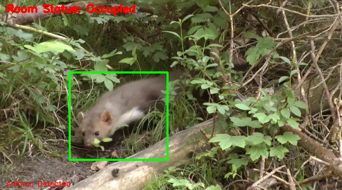

# Madar-Animal-Detection-Raspberrypi-based-on-motion-and-color-with-pan-tilt-camera-movement
Madar Animal Detection Raspberrypi based on motion and color with pan tilt camera movement

### Libraries Required:
      	PiRGBArray
      	Picamera
      	Numpy
      	 Imutils
      	cv2
      	RPi.GPIO
      	time
      

### Code Working

#### 1-	Servo Initialization:  

              servoPIN = 17   	#Connect your 17pin of raspberry pi to servo or any motor you want to control.
              servoAngle= 90 # For user decision, servo angle when motion detected. 
              GPIO.setmode(GPIO.BCM)
              GPIO.setup(servoPIN, GPIO.OUT)
              p = GPIO.PWM(servoPIN, 50) 	# GPIO 17 for PWM with 50Hz
              p.start(0) 	# Initialization,start at 0 duty cycle so it doesn't set any angles on startup
              
              

#### 2-	Camera Setting:

              #initialize the camera and grab a reference to the raw camera capture
              camera = PiCamera()
              camera.resolution = tuple([640, 480]) #Set camera Resolution
              camera.framerate = 16 # 16 frame per sec
              rawCapture = PiRGBArray(camera, size=tuple([640, 480])) # rgb capturing directly 
              print("[INFO] warming up...") 
              time.sleep(2.5) # camera starting time 
              firstFrame = None  # first frame for comparison
              motionCounter = 0 # motion required for detecting an animal and starting the servo
              minmotion = 5 # minmum motion for servo working

#### 3-	Animal color Range RGB

              lower = [65, 49, 28]# for color range of animal start to end
              upper = [187, 159, 174] #  Setting up the color range of animal
 

#### 4-	General Code:

              for f in camera.capture_continuous(rawCapture, format="bgr", use_video_port=True):
                  #grab the raw NumPy array representing the image and initialize
                  #the timestamp and occupied/unoccupied text
                  frame = f.array
                  text = "No Motion"

                  framecopy=frame.copy()
                  #resize the frame, convert it to grayscale, and blur it
                  frame = imutils.resize(frame, width=500)
                  gray1 = cv2.cvtColor(frame, cv2.COLOR_BGR2GRAY)
                  gray = cv2.GaussianBlur(gray1, (21, 21), 0)

                  # if the first frame is None, initialize it
                  if firstFrame is None or p==200:
                      p=0
                      firstFrame = gray.copy()
                      rawCapture.truncate(0)
                      continue
                  p=p+1

                  # accumulate the weighted average between the current frame and
                  # previous frames, then compute the difference between the current
                  # frame and running average
                  cv2.accumulateWeighted(gray, firstFrame, 0.5)
                  frameDelta = cv2.absdiff(gray, cv2.convertScaleAbs(firstFrame))

                  # threshold the delta image, dilate the thresholded image to fill
                  # in holes, then find contours on thresholded image
                  thresh = cv2.threshold(frameDelta, 5, 255, cv2.THRESH_BINARY)[1]

                  thresh = cv2.dilate(thresh, None, iterations=2)
                  cnts = cv2.findContours(thresh.copy(), cv2.RETR_EXTERNAL,cv2.CHAIN_APPROX_SIMPLE)
                  # loop over the contours

                  cnts = cnts[0] if imutils.is_cv2() else cnts[1]

                  for c in cnts:
                      # if the contour is too small, ignore it
                      if cv2.contourArea(c) < 600:
                          continue
                      # compute the bounding box for the contour, draw it on the frame,
                      #print(cv2.contourArea(c))# and update the text
                      (x, y, w, h) = cv2.boundingRect(c)
                      ccc=framecopy[y: y+h, x: x+w].copy()

                      # find the colors within the specified boundaries and apply
                      # the mask
                      mask = cv2.inRange(ccc, lower, upper)
                      kernel = cv2.getStructuringElement(cv2.MORPH_RECT, (25, 1))
                      detectarea = cv2.morphologyEx(mask, cv2.MORPH_CLOSE, kernel)
                      contours = cv2.findContours(detectarea.copy(), cv2.RETR_EXTERNAL, cv2.CHAIN_APPROX_NONE)
                      contours = contours[0] if imutils.is_cv2() else contours[1]

                      #mask = np.zeros(ccc.shape, dtype=np.uint8)
                      for d in contours:
                          if cv2.contourArea(d) < 3000:
                              continue
                          #print(cv2.contourArea(d))
                          text1= "Detected"
                          cv2.putText(frame, "Animal: {}".format(text1),(10, frame.shape[0] - 10), cv2.FONT_HERSHEY_SIMPLEX, 0.35, (0, 
                                      0, 255), 1)
                          cv2.rectangle(frame, (x, y), (x + w, y + h), (0, 255, 0), 2)
                          motionCounter += 1
                          if motionCounter > minmotion:
                              minmotion = 0
                              duty = servoAngle / 18 + 2
                              GPIO.output(servoPIN, True)
                              pwm.ChangeDutyCycle(duty)
                              sleep(1)
                              print("Servo start")

                      text = "Motion Detected"
                  # draw the text and timestamp on the frame
                  cv2.putText(frame, "Status: {}".format(text), (10, 20),cv2.FONT_HERSHEY_SIMPLEX, 0.5, (0, 0, 255), 2)
                  # show the frame and record if the user presses a key
                  # check to see if the frames should be displayed to screen
                  if showvideo=="yes":
                      # display the security feed
                      cv2.imshow("Security Feed", frame)
                      key = cv2.waitKey(1) & 0xFF

                      # if the `q` key is pressed, break from the lop
                      if key == ord("q"):
                          break

                  # clear the stream in preparation for the next frame
                  rawCapture.truncate(0)

              p.stop()
              GPIO.cleanup()
              GPIO.output(servoPIN, False)
              pwm.ChangeDutyCycle(0)

 
 

 
 

